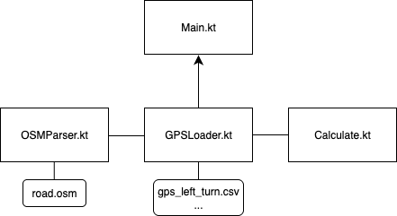

# 과제 1

## 지원자 정보
    - 이름: 이민서
    - 연락처: 010-9538-9465
    - 이메일: real2ms@naver.com

## 프로젝트 실행 방법
    - 번거로우시겠지만 Android Studio와 같은 Gradle 사용 툴에서 실행이 가능합니다.
    (과제 제출을 위해 모듈만 복사해서 붙여놓은 것이라 이 프로젝트 내에서 run code가 실행되지 않습니다.)
    1. 모듈 생성(ex. kot)
    2. src > main > com.example.kot > 코틀린 파일 넣기
    3. src > resources(디렉토리 생성) > osm, csv 파일 넣기
    4. run code

## 결과물 설명
    - OSM 파일 불러오기 및 읽기
    - CSV 파일 불러오기 및 읽기
    - 거리, 방향(각도) 계산

## 설계 및 구조 다이어그램 (PDF, 이미지 등 형식 자유) 작성
