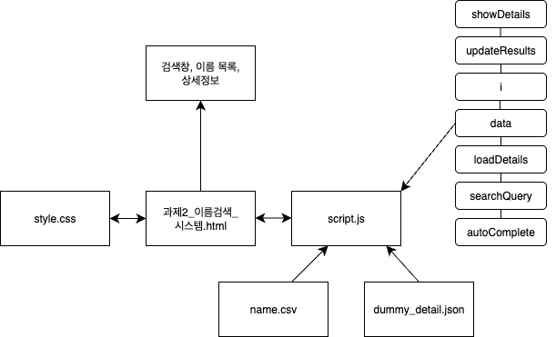

# 과제 2: 이름 검색 시스템

## 지원자 정보
    - 이름: 이민서
    - 연락처: 010-9538-9465
    - 이메일: real2ms@naver.com

## 프로젝트 실행 방법
    - VSCode Live Server 사용 시
        - '과제2_이름검색_시스템.html'에서 우측하단의 'Go Live' 클릭
    - git clone 또는 다운로드 후 파일 내에서 '과제2_이름검색_시스템.html' 실행
    1. 검색창에 이름(영어) 입력
    2. 자동완성 및 목록 확인
    3. 이름 클릭
    4. 상세 정보 표시 확인
    5. 입력어 삭제 시 목록 및 상세 정보 초기화

## 결과물 설명
### 문제점
    - HTML, CSS, JS, 데이터 한 파일 내 구현
    - 의미를 알기 어려운 변수
    - 검색창에 한 글자 입력 시 커서 비활성화
    - 이름 클릭 비활성화 및 정보 반환 기능 없음
    - 데이터량 증가에 따른 지원
### 개선점
    - HTML, CSS, JS, 데이터 역할 따라 파일 분리
    - 의미가 담긴 변수로 수정
    - 입력창을 재생성하지 않고 그대로 유지하여 커서 깜빡임 정상화
    - 이름 클릭 활성화 및 API 사용하여 상세 정보 제공
    - debounce 사용하여 입력 지연 처리

## 설계 및 구조 다이어그램 (PDF, 이미지 등 형식 자유) 작성

